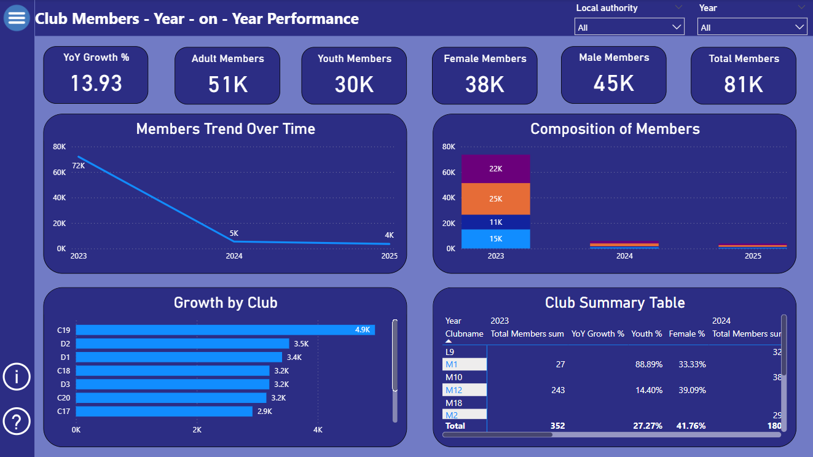
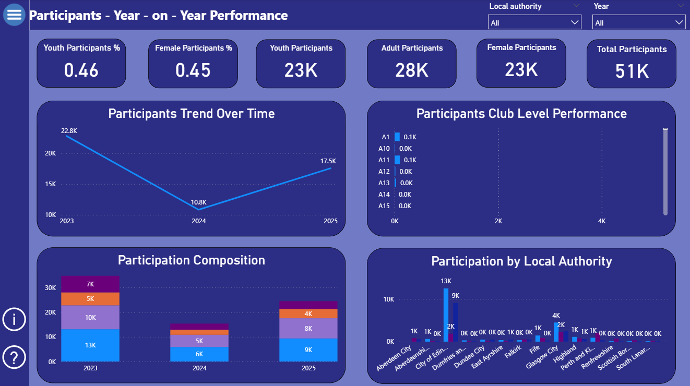
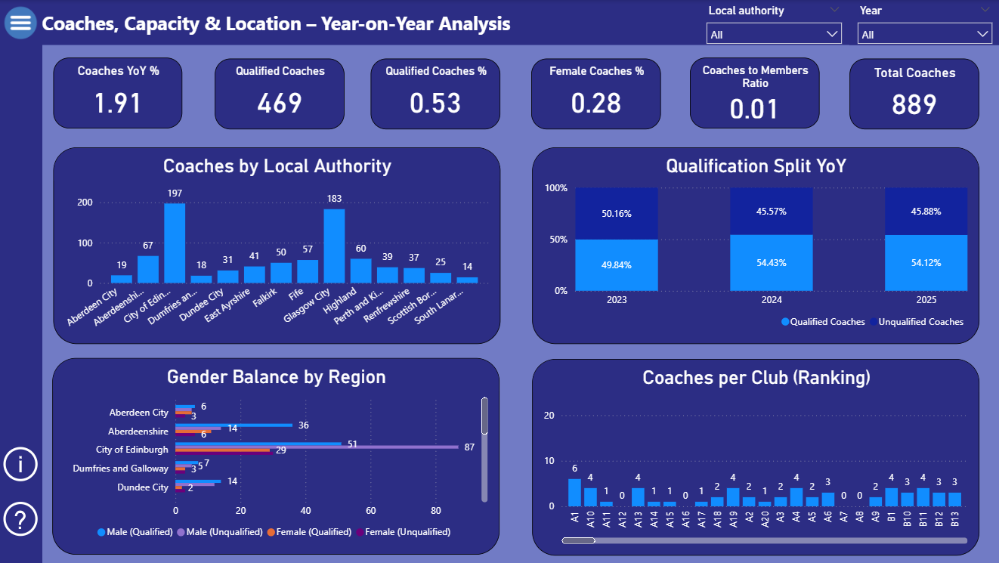

🏅 Sport Scotland, Membership & Coaching Analysis (Power BI)

📌 Project Overview

This project was undertaken as a self-initiated Power BI challenge to deepen my skills in data modelling, DAX calculations, and analytical storytelling using real-world public sector data.

Using publicly available data from the sportscotland website, I analysed how sport participation is changing over time across Scotland, focusing on club members, participants, and coaching capacity. The report highlights year-on-year (YoY) trends, demographic composition, and geographic variation to support evidence-based decision-making.

🎯 Context & Data Source

sportscotland works with Scottish Governing Bodies (SGBs) to increase participation in sport across Scotland.
As part of this, data is published annually covering:

Club membership

Participants (non-members)

Coaches

Local authority distribution

This project analyses three years of data (2023–2025) for one governing body.

📊 Dashboard Structure

The Power BI report is organised into three analytical pages, supported by a custom navigation menu built using bookmarks and buttons for a professional, app-like experience.

📈 Page 1: Club Members – Year-on-Year Performance

This page focuses on how formal club membership has evolved over time, with a strong emphasis on YoY growth, gender balance, youth engagement, and club-level performance.

Key insights include:

Overall membership growth across the three-year period

Differences in growth rates between clubs

Changes in youth and female representation year-on-year

Key visuals:

KPI cards (Total Members, YoY Growth %, Youth %, Female %)

Line chart showing membership trends over time

Stacked bar chart showing adult vs youth and male vs female composition

Club ranking bar chart

Detailed club summary matrix with YoY metrics

🏃 Page 2: Participants – Year-on-Year Performance

This page analyses participants who are not formal club members, providing insight into broader engagement and future membership potential.

Key insights include:

YoY growth in total participants

Adult vs youth participation split

Female participation share

Variation in participation across clubs and local authorities

Key visuals:

KPI cards (Total Participants, Youth %, Female %)

Participation trend over time

Participation composition by year

Club-level participation performance

Participation by local authority

Core DAX used on this page:

Aggregated participant measures

YoY change logic

Demographic percentage calculations

Core DAX used on this page:

Year-on-Year calculations

Percentage share measures

Previous year comparisons

🧑‍🏫 Page 3: Coaches, Capacity & Location – Year-on-Year Analysis

This page focuses on coaching capacity, assessing whether the supply of coaches is keeping pace with participation and membership growth.

Key insights include:

Total coaches and YoY change

Qualified vs unqualified coach split

Female coach representation

Geographic distribution of coaches

Coaches-to-members ratio

Key visuals:

KPI cards (Total Coaches, Qualified %, Female %)

Coaches by local authority

Qualification split over time

Gender balance by region

Coaches per club ranking

Core DAX used on this page:

Qualification split logic

Ratio-based measures

YoY coach growth calculations

👤 Author

Neeraj Raj Srinivasa Raju
Business Intelligence | Data Analytics | Power BI
📍 UK
